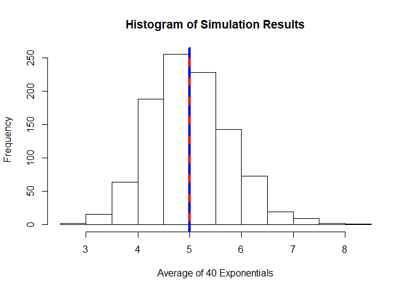

## Overview

This document is for the Statistical Inference course from Johns Hopkins
University within the Data Science Specialization on Coursera. This is part one
of a two part assignment. The instructions say:

>Illustrate via simulation and associated explanatory text the properties of the
distribution of the mean of 40 exponentials. You should:
>
1. Show the sample mean and compare it to the theoretical mean of the
distribution.
2. Show how variable the sample is (via variance) and compare it to the
theoretical variance of the distribution.
3. Show that the distribution is approximately normal.
>
In point 3, focus on the difference between the distribution of a large
collection of random exponentials and the distribution of a large collection of
averages of 40 exponentials.


## Simulations

The first step is to simulate 1000 averages of 40 exponentials. For the purpose
of this exercise all of the simulation results are not actually needed. It is
only required to capture the means, so in the interest of simplicity a function
will be created which takes the mean of exponentials. This function is shown
below.


```r
# Define a function which takes the mean of exponentials
MeanOfExponentials <- function(n.obs, lambda) {
  # Takes the mean of exponentials from the rexp() function
  #
  # Args:
  #   n.obs: The number of observations variable, passed to rexp()
  #   lambda: The rate variable of the exponential, passed to rexp()
  #
  # Returns:
  #   The mean of the exponentials
  exp.mean <- mean(rexp(n.obs, lambda))
  return(exp.mean)
}
```

This function can then be used and replicated to obtain the desired result.


```r
# Perform simulation
set.seed(190205)  # Set seed for reproducibility
# The instructions specify 1000 simulations of 40 exponentials with rate 0.2
n <- 40  # Set the number of observations per simulation
lambda <- 0.2  # Set the rate
sim.results <- replicate(1000, MeanOfExponentials(n, lambda))  # Do 1000 sims
str(sim.results)  # Show structure/preview
```

```
##  num [1:1000] 4.51 4.54 5.83 4.75 4.7 ...
```

The result is a numeric vector of length 1000 where each value is the average of
that set of 40 exponentials.


## Sample Mean versus Theoretical Mean

The next task is to show the sample mean and compare it to the theoretical mean.
The instructions also ask to show this in a figure.


```r
# Calculate the sample mean and theoretical mean
sample.mean <- mean(sim.results)  # 4.99928
theoretical.mean <- 1/lambda  # 5

# Show as a figure, first create histogram
hist(sim.results, main = "Histogram of Simulation Results",
     xlab = "Average of 40 Exponentials")
# Add vertical lines for the means, one is solid red the other is dashed blue
abline(v = c(sample.mean, theoretical.mean), lwd = c(4, 4),
       col = c("red", "blue"), lty = c(1, 2))
```

<!-- -->

The results above show that the sample mean of 4.99928 is very close to
the theoretical mean of 5. The plot shows how the simulation
results are distributed and with the vertical lines esssentially overlapping it
is clear how close the sample mean is to the theoretical mean.


## Sample Variance versus Theoretical Variance

The next task is to show how variable the sample is (via variance) and compare
it to the theoretical variance of the distribution.


```r
# Calculate the sample variance and the theoretical variance
sample.variance <- var(sim.results)  # 0.59796
theoretical.variance <- 1/(n * lambda^2)  # 0.625
```

The sample variance of 0.5979585 is fairly close to the theoretical
variance of 0.625. 


## Distribution

The final step is to show that the distribution is approximately normal and show
the effect of the central limit theorem.


```r
# Show that the distribution is approximately normal
par(mfrow = c(1, 2))  # Setup plot space
hist(sim.results, freq = FALSE, main = "Histogram of Simulation Results",
     xlab = "Average of 40 Exponentials")  # Plot simulation results by prob.
# Next a line representing a normal distribution will be overlaid on this plot
curve(dnorm(x, mean = theoretical.mean, sd = sqrt(theoretical.variance)),
      add = TRUE)
# Here the curve() function plots a function of x. The dnorm() function is the
# expression for the normal distribution, and here it is written as a function
# of x. Also dnorm() is scaled to the theoretical mean and standard deviation of
# this situation.

# Add a Q-Q plot to this figure
qqnorm(sim.results, main = "Q-Q Plot of Simulation Results")
qqline(sim.results)  # Add reference line
```

<!-- -->

In the figure above the histogram appears to follow the reference line well. The
Q-Q plot further reinforces the normality. These simulation results are
approximately normal.

The instructions also ask to demonstrate the effect of the central limit
theorem. This can be shown easily with another simulation where no mean is taken
and each sample size is just 1.


```r
# Run another simulation, but without taking the mean or many observations
sim.results2 <- replicate(1000, rexp(1, lambda))  # Do 1000 sims of 1 obs
theoretical.variance2 <- 1/(lambda^2)  # 25

# Plot the new simulation results as before
par(mfrow = c(1, 2))  # Setup plot space
hist(sim.results2, freq = FALSE, main = "Histogram of Random Exponentials",
     xlab = "Random Exponentials")  # Plot the simulation resuls by probability
curve(dnorm(x, mean = theoretical.mean, sd = sqrt(theoretical.variance2)),
      add = TRUE)  # Add the corresponding normal curve
# Add a Q-Q plot to this figure
qqnorm(sim.results2, main = "Q-Q Plot of Random Exponentials")
qqline(sim.results2)  # Add reference line
```

<!-- -->

These simulation results follow the underlying distribution (exponential), so
the normal curve does not fit as well in the first plot. The Q-Q plot makes it
much more obvious that the distribution is not normal. This shows the power of
the CLT, that by taking the mean and taking large samples the distribution
becomes more normal.

