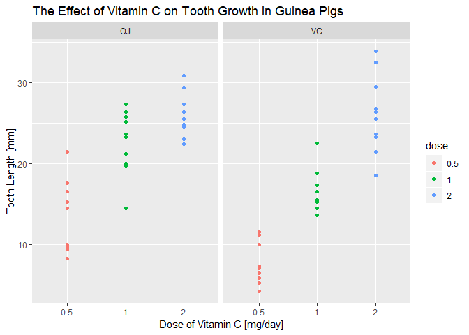
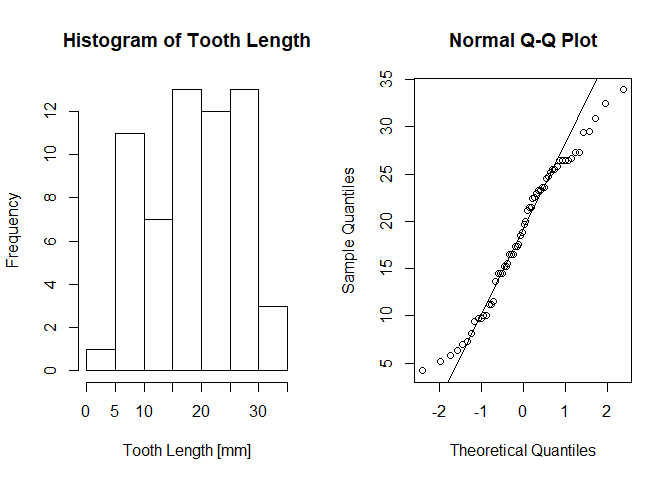

## Introduction

This document is for the Statistical Inference course from Johns Hopkins
University within the Data Science Specialization on Coursera. This is part two
of a two part assignment. The instructions say:

>Now in the second portion of the project, we're going to analyze the
`ToothGrowth` data in the R `datasets` package.
>
1. Load the `ToothGrowth` data and perform some basic exploratory data analyses
2. Provide a basic summary of the data.
3. Use confidence intervals and/or hypothesis tests to compare tooth growth by
`supp` and `dose`. (Only use the techniques from class, even if there's other
approaches worth considering)
4. State your conclusions and the assumptions needed for your conclusions.

The `dplyr` and `ggplot2` packages are required to execute this code. The input
for this document is the `ToothGrowth` dataset, and the output is this report
which is generated from a markdown file using `knitr`.


## Part 1: Load the data and perform some basic EDA

The first step is to get the data loaded and explore it:


```r
# Load required packages
library(dplyr)
library(ggplot2)


# Load the ToothGrowth data and perform some basic exploratory data analysis
tooth.data <- as_tibble(ToothGrowth)  # Load data as a tibble
str(tooth.data)  # Display structure
```

```
## Classes 'tbl_df', 'tbl' and 'data.frame':	60 obs. of  3 variables:
##  $ len : num  4.2 11.5 7.3 5.8 6.4 10 11.2 11.2 5.2 7 ...
##  $ supp: Factor w/ 2 levels "OJ","VC": 2 2 2 2 2 2 2 2 2 2 ...
##  $ dose: num  0.5 0.5 0.5 0.5 0.5 0.5 0.5 0.5 0.5 0.5 ...
```

```r
head(tooth.data)  # View first 6 rows
```

```
## # A tibble: 6 x 3
##     len supp   dose
##   <dbl> <fct> <dbl>
## 1   4.2 VC      0.5
## 2  11.5 VC      0.5
## 3   7.3 VC      0.5
## 4   5.8 VC      0.5
## 5   6.4 VC      0.5
## 6  10   VC      0.5
```

It is recommended to check the dataset documentation with `?ToothGrowth` for
additional detail. The first variable, `len`, is the length of the cells
responsible for tooth growth in guinea pigs. In the documentation the units of
the `len` variable are not provided. Based on its values it seems possible that
the measurements are in millimeters. The analysis will proceed on this
assumption. The `supp` variable indicates the supplement type, either `OJ` for
orange juice, or `VC` for ascorbic acid. The last variable `dose` indicates the
dosage level of vitamin C that was received.


```r
# Prepare data for plot
tooth.data <- mutate(tooth.data, dose = as.factor(dose))  # Make "dose" a factor

# Plot the data
print(qplot(x = dose, y = len, data = tooth.data, facets = ~ supp, color = dose,
            main = "The Effect of Vitamin C on Tooth Growth in Guinea Pigs",
            xlab = "Dose of Vitamin C [mg/day]", ylab = "Tooth Length [mm]"))
```

<!-- -->

In the plot above higher `dose` appears to correlate with longer tooth length,
and it is difficult to say if there is a correlation to supplement type.


## Part 2: Provide a basic summary of the data

Next a basic summary of the data is provided


```r
summary(tooth.data)
```

```
##       len        supp     dose   
##  Min.   : 4.20   OJ:30   0.5:20  
##  1st Qu.:13.07   VC:30   1  :20  
##  Median :19.25           2  :20  
##  Mean   :18.81                   
##  3rd Qu.:25.27                   
##  Max.   :33.90
```

The summary shows that the `len` variable ranges from 4.20 to 33.90 with a mean
of 18.81. There are 60 total observations - 30 each with the two supplement
types: orange juice and ascorbic acid. There are 20 observations each of the 3
dosage levels. Basically there are six groups and each of them has 10
observations.


## Part 3: Compare tooth growth by `supp` and `dose`

Next, hypothesis tests will be used to compare tooth growth by supplement type
and dosage amount. However, before proceeding the assumptions required for
t-tests should be reviewed:

1. Means of populations follow a normal distribution
2. Variances of populations are equal
3. Data are sampled independently from the populations

These assumptions will be checked before continuing; first check if data follow
a normal distribution:


```r
# Make plots to check normality
par(mfrow = c(1, 2))  # Setup plot space
hist(tooth.data$len, main = "Histogram of Tooth Length",
     xlab = "Tooth Length [mm]")  # Plot histogram

# Check a Q-Q Plot also
qqnorm(tooth.data$len)  # Plot data
qqline(tooth.data$len)  # Add the normal line
```

<!-- -->

The histogram doesn't look very normal, but it's reasonably symmetric. A Q-Q
plot is also shown, and while it isn't perfect, the t-test is robust to the
normality assumption. The analysis will continue assuming the data are normal
enough.

The second check is of the variance, which does appear to be reasonably equal in
this case. However, the `t.test()` function is capable of compensating for
unequal variance, so that method will be used to remain conservative.

Lastly, there is no reason to believe the data were not sampled independently.
Additionally, there is no way to test for this assumption, so analysis will
continue assuming that all conditions for the two-sided t-test are met.

The first hypothesis test investigates the effect of the supplement type. The
hypotheses are stated below:

* H_0: mu_oj = mu_vc (There is no significant difference in the means)
* H_a: mu_oj != mu_vc (There is a significant difference in the means)

These will be evaluted using the `t.test()` function:


```r
# The t.test function will be used to evaluate the hypotheses
t.test(x = filter(tooth.data, supp == "VC")$len,
       y = filter(tooth.data, supp == "OJ")$len)
```

```
## 
## 	Welch Two Sample t-test
## 
## data:  filter(tooth.data, supp == "VC")$len and filter(tooth.data, supp == "OJ")$len
## t = -1.9153, df = 55.309, p-value = 0.06063
## alternative hypothesis: true difference in means is not equal to 0
## 95 percent confidence interval:
##  -7.5710156  0.1710156
## sample estimates:
## mean of x mean of y 
##  16.96333  20.66333
```

The p-value of this test is 0.06063, so the test is not significant at the 0.95
confidence level. There does not appear to be a significant difference between
the supplement types.

Next, the effect of the dose will be explored, but the instructions specify that
only methods taught in the course up to this point can be used. Because of this
t-tests will be used again even though other methods could be superior.

The next test will compare the 0.5 dose level to the 1.0 dose level, and the
hypotheses are stated below:

* H_0: mu_05 = mu_10 (There is no significant difference in the means)
* H_a: mu_05 != mu_10 (There is a significant difference in the means)

These are evaluated below:


```r
# The t.test function will be used to evaluate the hypotheses
t.test(x = filter(tooth.data, dose == "0.5")$len,
       y = filter(tooth.data, dose == "1")$len)
```

```
## 
## 	Welch Two Sample t-test
## 
## data:  filter(tooth.data, dose == "0.5")$len and filter(tooth.data, dose == "1")$len
## t = -6.4766, df = 37.986, p-value = 1.268e-07
## alternative hypothesis: true difference in means is not equal to 0
## 95 percent confidence interval:
##  -11.983781  -6.276219
## sample estimates:
## mean of x mean of y 
##    10.605    19.735
```

The p-value of this test is 1.268e-07 which is extreemly small and is
significant at the 0.95 confidence level. One more test will be checked below.

The last test will compare the 1.0 dose level to the 2.0 dose level, and the
hypotheses are stated below:

* H_0: mu_10 = mu_20 (There is no significant difference in the means)
* H_a: mu_10 != mu_20 (There is a significant difference in the means)

These are evaluated below:


```r
# The t.test function will be used to evaluate the hypotheses
t.test(x = filter(tooth.data, dose == "1")$len,
       y = filter(tooth.data, dose == "2")$len)
```

```
## 
## 	Welch Two Sample t-test
## 
## data:  filter(tooth.data, dose == "1")$len and filter(tooth.data, dose == "2")$len
## t = -4.9005, df = 37.101, p-value = 1.906e-05
## alternative hypothesis: true difference in means is not equal to 0
## 95 percent confidence interval:
##  -8.996481 -3.733519
## sample estimates:
## mean of x mean of y 
##    19.735    26.100
```

The p-value of this test is 1.906e-05 which is extreemly small and is
significant at the 0.95 confidence level. Between these two tests it does appear
that the dose level is significantly correlated with tooth length. A correction
could be applied to compensate for the fact that two tests were conducted, but
the p-values are low enough that the results would still be significant.


# Part 4: State your conclusions and assumptions

The conclusions of this analysis are that tooth growth in guinea pigs does have
a statistically significant correlation with the dosage level of vitamin C.
Another conclusion is that tooth growth was not significantly correlated with
the types of vitamin C used in the experiment.

The analysis only required two assumptions to reach these conclusions:

1. Means of populations follow a normal distribution
2. Data are sampled independently from the populations

While the t-test is robust to the normality assumption, plots were created above
which showed that the data are reasonably normal. While the variance appears to
be homogenous in this case, it was compensated for in the t-test which assumed
unequal variance. The assumption for independent sampling seems reasonable as
well, so the conclusions reached here are based on reasonable assumptions.

